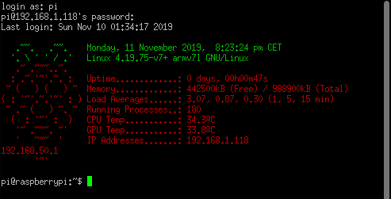
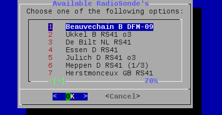
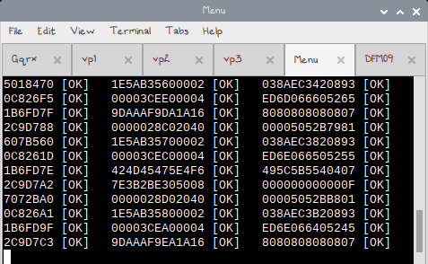
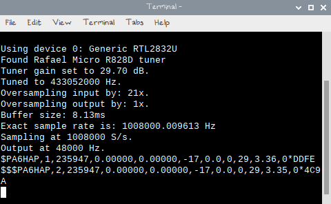

<!DOCTYPE html>
<html class="no-js" lang="en">
  <head>
  </head>
  <body>
    

      
 
        

          <h1>Raspberry Pi and SDR 
          </h1>
          

          

          

            
  

            Raspberry Pi 3 Model B+ 

           
          The Raspberry Pi is a series of small single-board computers
          developed by the Raspberry Pi Foundation to promote the
          teaching of basic computer science in schools and in
          developing countries. 
           
          RTL-SDR dongles are often used on single board computers.  
          These small credit sized computers are powerful enough to run
          multiple dongles, and run various decoding programs.  
          Currently, the most popular of these small computers is the
          Raspberry Pi. 
           
          This guide shows a setup with various Radiosonde Decoding
          programs such as Auto-RX, DxlAPRS, RS-Decoders, Sondefinder
          and more SR Goodies! 
          If the Pi runs rtl_tcp, SpyServer or a similar server, then
          the RTL-SDR can then be accessed by a networked connected PC
          anywhere in your house, or even remotely over the internet
          from anywhere in the world. 
           
           
          

            
Contents:

            <ul>
              <li>Overview
                <ul>
                  <li>1.1&nbsp; <a href="#Raspberry_Hardware_">Raspberry Hardware</a> </li>
                  <li>1.2&nbsp; <a href="#Raspberry_-_Raspian_Buster_Install">Raspian Buster Install</a> </li>
                  <li>1.3&nbsp; <a href="#LCD_Display_Install_">Install LCD Driver</a> </li>
                  <li>1.4&nbsp; <a href="#Install_RTL-SDR_USB_Drivers:_">Install RTL-SDR Driver</a> </li>
                  <li>1.5&nbsp; <a href="#Dependencies_">Dependencies</a> </li>
                  <li>1.6&nbsp; <a href="#GPSD_">GPSD Setup</a> </li>
                  <li>1.7&nbsp; <a href="#RS-Decoder_Scripts_">RS-Decoder Scripts</a> </li>
                  <li>1.8&nbsp; <a href="#Foxtrot_GPS_">FoxtrotGPS</a> </li>
                  <li>1.9&nbsp; <a href="#Navit_">Navit</a></li>
                  <li>2.0&nbsp; <a href="#Gqrx_">Gqrx</a></li>
                  <li>2.1&nbsp; <a href="#Virtual_Audio_Setup_">Virtual Audio Setup</a></li>
                  <li>2.2&nbsp; <a href="#librtlsdr_errors_and_workarounds">Librtlsdr Errors</a> </li>
                  <li>2.3&nbsp; <a href="#Auto-RX_">Auto-RX</a></li>
                  <li>2.4&nbsp; <a href="#DxlAPRS_">DxlAPRS</a></li>
                  <li>2.5&nbsp; <a href="#APRS-Map_">APRS-Map</a></li>
                  <li>2.6&nbsp; <a href="#GPS2APRS_">GPS2APRS</a></li>
                  <li>2.7&nbsp; <a href="#RS-Decoder_with_APRS-Map._">RS-Decoder APRS-Map</a> </li>
                  <li>2.8&nbsp; <a href="#SondeFinder_">SondeFinder</a></li>
                  <li>2.9&nbsp; <a href="#Multi-SDR_Script">MultiSDR</a></li>
                  <li>3.0&nbsp; <a href="#Direwolf_">Direwolf</a> </li>
                  <li>3.1&nbsp; <a href="#Dump_VDL2_">DumpVDL2</a></li>
                  <li>3.2&nbsp; <a href="#FM-Transmitter_">FM-Transmitter</a></li>
                  <li>3.3&nbsp; <a href="#HeatMap_">HeatMap</a></li>
                  <li>3.4&nbsp; <a href="#Multimon_">Multimon</a></li>
                  <li>3.5&nbsp; <a href="#Qt-DAB_">Qt-DAB</a></li>
                  <li>3.6&nbsp; <a href="#Retrogram_">Retrogram</a></li>
                  <li>3.7&nbsp; <a href="#RTL_433_">RTL_433</a></li>
                  <li>3.8&nbsp; <a href="#rtl_tcp_and_Spyserver_">RTL-TCP and Spyserver </a> </li>
                  <li>3.9&nbsp; <a href="#RTTY-Decoder_">RTTY-Decoder</a></li>
                  <li>4.0&nbsp; <a href="#Vor-Track_">Vor-Track</a></li>
                  <li>4.1&nbsp; <a href="#OpenWebRX_">OpenWebRX</a> </li>
                  <li>4.2&nbsp; <a href="#RaspAP_">RaspAP</a></li>
                  <li>4.3&nbsp; <a href="#RPi-Monitor_">Rpi-Monitor</a></li>
                  <li>4.4&nbsp; <a href="#Tweaks_">Tweaks</a></li>
                  <li>4.5&nbsp; <a href="#Backup_Scripts_">Backup Scripts</a> </li>
                </ul>
              </li>
            </ul>
          

          <h2>Raspberry
            Hardware&nbsp;&nbsp;&nbsp;&nbsp;&nbsp;&nbsp;&nbsp;&nbsp;&nbsp;&nbsp;&nbsp;&nbsp;&nbsp;&nbsp;&nbsp;&nbsp;&nbsp;&nbsp;&nbsp;&nbsp;&nbsp;&nbsp;&nbsp;&nbsp;&nbsp;
             
          </h2>
           
          Raspberry Pi... 
           
          
  
          

          
3.5 inch TFT Lcd Touch Screen Raspberry Pi 480x320 RGB
            Pixels. 
          

          &nbsp; 
          
 &nbsp;&nbsp;&nbsp;&nbsp;&nbsp;&nbsp;&nbsp;&nbsp;&nbsp;&nbsp;&nbsp;&nbsp;&nbsp;&nbsp;&nbsp;&nbsp;&nbsp;&nbsp;&nbsp;&nbsp;&nbsp;&nbsp;&nbsp;&nbsp;&nbsp;&nbsp;&nbsp;&nbsp;&nbsp;&nbsp;&nbsp;&nbsp;&nbsp;
             
          

          
 RTL-SDR USB Adapter RTL2832U + R820T2 + 1PPM TCXO TV Tuner
            Stick Ontvanger Oscillator. 
            RTL-SDR Blog V3 R820T2 RTL2832U 1PPM TCXO SMA Software
            Defined Radio 
          

          &nbsp;&nbsp;&nbsp;&nbsp;&nbsp;&nbsp;&nbsp;&nbsp;&nbsp;&nbsp;&nbsp;&nbsp;
          
            
          DFM09 Modified GPS-Mouse, Wireless Keyboard and Powerbank. 
           
          &nbsp;
           
           
          Some extra cooling stuff. 
          <h2>Raspberry
            - Raspian Buster LXDE Install&nbsp;&nbsp;  
          </h2>
          
 
            Install Buster preferred is Lite --&gt;&gt; <a
              href="https://downloads.raspberrypi.org/raspbian_lite/images/">https://downloads.raspberrypi.org/raspbian_lite/images/</a> 
            <a
              href="https://downloads.raspberrypi.org/raspbian_lite/images/">
              <meta http-equiv="content-type" content="text/html;
                charset=UTF-8">
            </a>
            <meta http-equiv="content-type" content="text/html;
              charset=UTF-8">
            Full --&gt;&gt;&nbsp;&nbsp; <a
              href="https://downloads.raspberrypi.org/raspbian_full/images/">https://downloads.raspberrypi.org/raspbian_full/images/</a> 
            Unzip and burn to SD <a
href="https://raspberry-projects.com/pi/pi-operating-systems/win32diskimager">https://raspberry-projects.com/pi/pi-operating-systems/win32diskimager</a>

          
Do not eject sd goto boot folder and make ssh file no
            contents inside, eject SD put in pi and boot.

          
 
            Find out in use IP (eth connected overhere) and login with <a
href="https://www.chiark.greenend.org.uk/%7Esgtatham/putty/latest.html">Putty</a> 
          

          
 

          
SSH 22 User: <b>pi</b> password: <b>raspberry</b>

          
<b>Change to new password:</b> 
            passwd 
             
          

          
<b>Paste in terminal for </b><b>update</b><b>:</b>

          
sudo apt-get update &amp;&amp; sudo apt-get upgrade -y
            &amp;&amp; sudo apt-get dist-upgrade 
             
            <b>Install x-server and deps:</b> 
          

          
sudo apt-get install --no-install-recommends xserver-xorg
            xinit xserver-xorg-input-evdev -y 
             
            <b>Install LXDE Desktop:</b> 
          

          
sudo apt-get install lxde-core lxappearance lxtask -y 
             
          

          
<b>Install Raspberry Stuff:</b> 
            sudo apt-get install raspberrypi-ui-mods -y 
          

          
 
            <b>Audio and Some other Programs:</b> 
          

          
sudo apt-get install pulseaudio pavucontrol preload pluma
            alacarte gpicview xfce4-terminal p7zip-full file-roller
            dialog -y 
             
            <b>Samba:</b> 
          

          
sudo apt-get install samba samba-common-bin 
             
            sudo smbpasswd -a pi 
            Then set a password as prompted. 
            &nbsp; 
            <b>Enable Auto-login, Display, Expand filesystem, VNC, WiFi
              ect with raspi-config:</b> 
            sudo raspi-config 
          

          
 Choose option 3: Boot Options 
            Choose option B1: Desktop / CLI and B4 Desktop Autologin
            Desktop Gui ect. 
             
          

          
 
          

           
          
Setup country WiFi in 4 Localization Options. 
            Select&nbsp; 5 Interface Options: 
            Enable P3 VNC. 
          

          
Select 7 Advanced options, A1 Expand Filesystem 
          

          
Select <b>Finish</b>, and<b> reboot the pi </b>hopefully
            return in Gui Desktop mode ;) 
             
          

          
Cleanup the install mess leftovers, sudo apt autoremove
            &amp;&amp; sudo apt clean 
          

          <h2>LCD Display Install 
          </h2>
          sudo raspi-config 
           
          Select&nbsp; 5 Interface Options: 
          Enable P4 SPI.<b> 
          </b><b> 
          </b> git clone https://github.com/waveshare/LCD-show.git 
          cd LCD-show/ 
          ./LCD35-show  
           
          With the recent updates in Raspbian Buster to Kernel v5, the
          old display driver is not working anymore. 
           
          sudo rm -rf LCD-show (remove old LCD-Show) 
           
          git clone https://github.com/MrYacha/LCD-show.git 
          chmod -R 755 LCD-show &amp;&amp; cd LCD-show/ 
          sudo ./LCD35-show 
           
          The LCD35 is a generic design made by lots of different
          manufacturers most of them use the ILI9486 driver and some
          work faster than others in terms of refresh rates.  
          There are slow 16MHz (blue pcb) and a fast 125MHz (black pcb)
          display versions. 
           
          To determin which refresh rate your display has, goto
          /var/log/kernel.log open it and search for string fb1. 
           
          The default setting is 15 MHz, which is slow but safe - you
          should have no problems with this speed, 
          but the display refresh isn't very fast.  
          If you can run the display at a faster clock rate, the refresh
          rate will improve. 
           
          In /boot/config.txt refresh rate set to 20MHz,
          dtoverlay=waveshare35a:speed=20000000 
          If the display does not support refresh rates above 20MHz
          colors acting weird and the screen flickers. 
           
          If you want to try different clock rates to see how fast your
          display will go, MrYacha GIT repo has also done a set of
          configurations at different clock rates for you to test.  
          Download the TAR archive here: <a
            href="https://ufile.io/vaeet36o" target="_blank">https://ufile.io/vaeet36o</a>
          to your Pi.  
          Then untar it and try the different dtbo/dto files (20 -
          115MHz) to see which is best for you. 
           
          tar -xf lcd.tar 
          sudo cp 20.dto /boot/overlays/waveshare35a.dtbo 
          sudo reboot 
          etc.
          <h2>Install
            RTL-SDR USB Drivers: 
          </h2>
          Open the terminal and Install the necessary tools: 
           
          sudo apt-get install git cmake build-essential
          libusb-1.0-0-dev 
           
          <b>Install RTL-SDR-Blog Driver:</b> 
           
          git clone git://github.com/happysat/rtl-sdr-blog.git 
          cd rtl-sdr-blog/ 
          mkdir build 
          cd build 
          cmake ../ -DINSTALL_UDEV_RULES=ON -DDETACH_KERNEL_DRIVER=ON 
          make 
          sudo make install 
          sudo ldconfig 
          sudo cp ../rtl-sdr.rules /etc/udev/rules.d/ 
          echo blacklist dvb_usb_rtl28xxu &gt;&gt; blacklist-rtl.conf 
          echo blacklist rtl2832 &gt;&gt; blacklist-rtl.conf 
          echo blacklist rtl2830 &gt;&gt; blacklist-rtl.conf 
          sudo cp blacklist-rtl.conf /etc/modprobe.d/ 
           
          Save the file and reboot the machine. 
           
          <b>Improvements:</b> 
           
          rtl_tcp is significantly improved by modifying to code to use
          a ring buffer instead of using semaphore based locking. 
          The result is a tremendous performance improvement in rtl_tcp. 
           
          After the ring buffer changes rtl_tcp can handle much better
          and higher maximum sample rate's with less lag.  
          Unfortunately this patch is not included in the official
          upstreamed Osmocom drivers. 
          <h2>Dependencies 
          </h2>
          sudo apt-get install xfce4-terminal&nbsp;  
          sudo apt-get install dialog  
          sudo apt-get install socat&nbsp;  
          sudo apt-get install perl&nbsp;&nbsp;  
          sudo apt-get install&nbsp; sox&nbsp;  
          sudo apt-get install gpsd gpsd-clients python-gps 
           
          Needed for: Tabbed terminal for small screens, menu scripts,
          pty-link virtualports, NMEA script, audio and GPS support.
          <h2>GPSD
            Setup&nbsp;&nbsp;&nbsp;&nbsp;&nbsp;&nbsp;&nbsp;&nbsp;&nbsp;&nbsp;&nbsp;&nbsp;&nbsp;&nbsp;&nbsp;&nbsp;&nbsp;&nbsp;&nbsp;&nbsp;&nbsp;&nbsp;&nbsp;&nbsp;&nbsp;&nbsp;&nbsp;&nbsp;&nbsp;&nbsp;&nbsp;&nbsp;&nbsp;&nbsp;&nbsp;&nbsp;&nbsp;&nbsp;&nbsp;&nbsp;&nbsp;&nbsp;&nbsp;&nbsp;&nbsp;&nbsp;&nbsp;&nbsp;&nbsp;
             
          </h2>
          
  
            In order to use gpsd with the decoder we have to <b>disable
              the service</b>. 
            So it can be manually started by the decoder:

          <b>sudo systemctl stop gpsd.socket</b> 
          <b>sudo systemctl disable gpsd.socket</b> 
           
          Should you ever want to enable the default gpsd systemd
          service you can run these commands to restore it: 
          <b>sudo systemctl enable gpsd.socket</b> and <b>sudo
            systemctl start gpsd.socket</b> 
          
 

          <h2>RS-Decoder Scripts 
          </h2>
          
 
            <a href="files/RS-Decoders.tar.gz?raw=true">Download</a> <b>Pre-Compiled
              Decoders</b>

          
<b><a
                href="https://github.com/happysat/RS-Binaries/tree/main/Raspberry" target="_blank">Updated
                compiled RS-Decoders are overhere.</a> 
               
            </b>

          
<b>Setup: 
            </b> 

          
Extract
            RS-Decoders.tar.gz

          
  
          

          
chmod 755 -R
            home/pi/Radio/Radiosonde

          
 
            <b>Create new group with the groupadd command:</b> 
            sudo groupadd dailout  
             
            <b>Add user to a group with the gpasswd command:</b> 
            sudo adduser pi dialout 
            <b> 
            </b>

          
<b>Make permissions for COM ports:</b>

          
Run ./home/pi/Radio/Radiosonde/vp1.sh so the virtual ports
            are accessible in /tmp for setting chown permissions.

          
 
          

          sudo chown -R pi:pi /tmp/virtualcom0 
          sudo chown -R pi:pi /tmp/virtualcom1 
           
          
 
             
          

          
Run shortcut from
            desktop, start <a href="#Foxtrot_GPS_">FoxtrotGPS</a>. 
             
          

          
 <b>Folders and Symlinks for the Decoders, the log files
              go overhere:</b>

          
mkdir /home/pi/log 
            mkdir /home/pi/tmp 
             
          

           
           
          
<b><a href="#Less_Read_and_Writes_on_SD_Card">/tmp is a
                virtual folder</a> 
            </b>

          
<b> 
              Compile decoders DFM-09/RS-41/M10/M20:</b> 
          

          
 
            git clone https://github.com/rs1729/RS 
            cd RS/demod/mod 
            gcc -c demod_mod.c -w -O3 
            gcc -c bch_ecc_mod.c -w -O3 
             
          

          
Compiling Mod
            DFM09/RS41 
            gcc rs41mod.c demod_mod.o bch_ecc_mod.o -lm -O3 -o rs41mod
            -w 
            gcc dfm09mod.c demod_mod.o -lm -O3 -o dfm09mod -w 
             
            Compiling Mod M10/20" 
            gcc m10mod.c demod_mod.o -lm -O3 -o m10mod -w 
            sleep 1 
            gcc mXXmod.c demod_mod.o -lm -O3 -o mXXmod -w 
          

          
 Or any other you
            need.

          
 You also <a
              href="https://github.com/rs1729/RS/tree/master/tools"
              target="_blank"><b>need pos2nmea.pl</b></a> (NMEA perl
            script) from folder RS/tools in the folder for GPS output! 
          

          <b><a href="#RS-Decoder_with_APRS-Map_and_GPS2APRS.">It is
              also possible to use the NMEA output of the RS-Decoders
              and feed data into APRSMap via UDP.</a></b> 
           
          <b>Example of script's:</b> 
           
          <b>DFM06/09: 
          </b>
          
dfm.sh 
            #!/bin/bash 
            rtl_fm -p 0 -g 42.1 -M fm -F9 -s 15K -f402870000
            2&gt;/dev/null | sox -t raw -r 15k -e s -b 16 -c 1 - -r
            48000 -b 8 -t wav - lowpass 2600 2&gt;/dev/null | ./dfm09mod
            --dist -vv --ptu --auto 2&gt;&amp;1 | tee -a
            /home/pi/Log/dfm09_`date +%Y%m%d%H`Z.txt | ./pos2nmea.pl
            &gt; /tmp/virtualcom0 
            exit

          
dfm_gps.sh

          
#!/bin/bash 
            xfce4-terminal -T vp -e ./vp.sh&nbsp; --tab -T DFM -e
            ./dfm.sh 
             
          

          

           
          <b>Gqrx </b><b><b>DFM06/09</b>: 
             
          </b>dfm_gqrx.sh 
          &nbsp;#!/bin/bash 
          sox -t alsa default -r 48000 -b 8 -t wav - lowpass 2600
          2&gt;/dev/null | ./dfm09mod --dist -v --ptu --auto 2&gt;&amp;1
          | tee -a /home/pi/Log/dfm09_`date +%Y%m%d%H`Z.txt |
          ./pos2nmea.pl &gt; /tmp/virtualcom0 
          exit 
          
dfm_gqrx_gps.sh 
            xfce4-terminal -T vp -e ./vp.sh --tab -T DFM -e
            ./dfm_gqrx.sh 
          

           
          
&nbsp;&nbsp;&nbsp;&nbsp;&nbsp;&nbsp;&nbsp;
             
          

           
          <b>RS41: 
          </b>  
          rs41.sh 
          #!/bin/bash 
          rtl_fm -p 0 -g 49.6 -M fm -F9 -s 9K -f405300000 2&gt;/dev/null
          | sox -t raw -r 9k -e s -b 16 -c 1 - -r 48000 -b 8 -t wav -
          lowpass 2600 2&gt;/dev/null | ./rs41mod --ecc2 --crc -vx --ptu
          2&gt;&amp;1 | tee -a /home/pi/Log/rs41_`date +%Y%m%d%H`Z.txt |
          ./pos2nmea.pl &gt; /tmp/virtualcom0 
          exit 
           
          rs41_gps.sh 
          #!/bin/sh 
          xfce4-terminal -T vp -e ./vp.sh --tab -T DeBilt -e
          ./rs41_bilt.sh 
           
           
           
          <b>Gqrx RS41: 
             
          </b> rs41_gqrx.sh 
          #!/bin/bash 
          sox -t alsa default -r 48000 -b 8 -t wav - lowpass 2600
          2&gt;/dev/null | ./rs41mod --ecc2 --crc -vx --ptu 2&gt;&amp;1
          | tee -a /home/pi/Log/rs41_`date +%Y%m%d%H`Z.txt |
          ./pos2nmea.pl &gt; /tmp/virtualcom0 
          exit 
          
rs41_gqrx_gps.sh 
            #!/bin/sh 
            xfce4-terminal -T vp -e ./vp.sh --tab -T RS41 -e
            ./rs41_gqrx.sh 
          

           
           
           
          <b>Virtual COM Ports:</b> 
          
 <b>vp.sh</b> 
          

          
#!/bin/bash 
             
            echo "Creating Virtual Com Port: 0 and 1" 
             
            vcpath='/tmp' 
            socat -d -d pty,link=${vcpath}/virtualcom0,raw,echo=0
            pty,link=${vcpath}/virtualcom1,raw,b4800,echo=0 &amp; 
            socatpid=$! 
            echo "socat pid=$socatpid" 
            sleep 2 
             
            trap "kill $socatpid &amp;&gt;/dev/null; exit 0" INT TERM
            EXIT 
             
            echo "Start GPSD on Virtual Com Ports" 
            killall -q gpsd 
            gpsd -D2 -b -n -N ${vcpath}/virtualcom1 
             
          

          
  

           
          
<b>Make permissions for COM ports:</b> 
          

          
Run ./vp1.sh so the virtual ports are accessible in /tmp
            for setting chown permissions.

          
 
          

          
 sudo chown -R pi:pi /tmp/virtualcom0 
            sudo chown -R pi:pi /tmp/virtualcom1 
             
          

          
As long as the socat (Terminal
            vp) is running, you have a pair of VPs open.

          They are named virtualcom 0 and 1 so they stay static and no
          dev/pts/ number change.  
           
          <b>What does it all mean.</b> 
           
          <b>rs41mod -h</b> 
          rs41mod [options] audio.wav 
          options: 
          &nbsp;-v, -vx, -vv&nbsp; (info, aux, info/conf) 
          &nbsp;-r, --raw 
          &nbsp;-i, --invert 
          &nbsp;--ths &lt;x&gt;&nbsp;&nbsp;&nbsp; (peak threshold;
          default=0.7) 
          &nbsp;--iq0,2,3&nbsp;&nbsp;&nbsp; (IQ data) 
           
          <b>dfm09mod -h</b> 
          dfm09mod [options] audio.wav 
          options: 
          &nbsp;-v, -vv 
          &nbsp;-r, --raw 
          &nbsp;-i, --invert 
          &nbsp;--ecc&nbsp;&nbsp;&nbsp;&nbsp;&nbsp;&nbsp;&nbsp; (Hamming
          ECC) 
          &nbsp;--ths &lt;x&gt;&nbsp;&nbsp;&nbsp; (peak threshold;
          default=0.6) 
          &nbsp;--json&nbsp;&nbsp;&nbsp;&nbsp;&nbsp;&nbsp; (JSON output) 
          &nbsp;--ecc2 now also gives the output after each block how
          many bits the error correction has corrected.  
          &nbsp;--ptu temperature Info 
          &nbsp;--dist is like ecc, but only blocks that belong to the
          same frame are taken, i. if errors occur, the frame is
          discarded / Inversed used for DFM06/90 
           
          
 

          

          <h2>Foxtrot GPS 
          </h2>
          
 
             &nbsp; &nbsp; &nbsp;&nbsp;  
             
          

          
 

          
<b>sudo apt-get instal foxtrotgps</b> 
          

          
Will install FoxtrotGPS v1.21 from feed. 
             
          

          
<b>For newer versions build from source:</b> 
          

          
Dependencies - <a
              href="https://www.foxtrotgps.org/build.html"
              target="_blank">https://www.foxtrotgps.org/build.html</a>

          
Download <a href="https://www.foxtrotgps.org/releases/"
              target="_blank">source</a> on FoxtrotGPS website. 
            &nbsp;

          
 <b>Insert extra Maps for FoxtrotGPS.</b> 
          

          Open FoxtrotGPS, goto Info Icon 3th screen, Map Types and
          select New, Insert: 
           
          http://tile.memomaps.de/tilegen/%d/%d/%d.png
          
 
          

          
          
 
          

          
For Thunderforest maps sign up free at their <a
              href="https://www.thunderforest.com/" target="_blank">website</a>
            to get api-key and insert it into the links below: 
             
          

          
<b>Example:</b> 
          

          
thunderforest_api_key = 123

          
https://tile.thunderforest.com/pioneer/%d/%d/%d.png?apikey=123 
            https://tile.thunderforest.com/cycle/%d/%d/%d.png?apikey=123 
https://tile.thunderforest.com/transport/%d/%d/%d.png?apikey=123 
https://tile.thunderforest.com/landscape/%d/%d/%d.png?apikey=123 
https://tile.thunderforest.com/outdoors/%d/%d/%d.png?apikey=123 
https://tile.thunderforest.com/transport-dark/%d/%d/%d.png?apikey=123 
https://tile.thunderforest.com/spinal-map/%d/%d/%d.png?apikey=123 
https://tile.thunderforest.com/neighbourhood/%d/%d/%d.png?apikey=123 
https://tile.thunderforest.com/mobile-atlas/%d/%d/%d.png?apikey=123 
          

          <h2>Navit 
          </h2>
          
<b> 
              Install Navit.</b> 
            sudo apt-get install navit 
             
          

          
It's <b>recommended</b> to follow this excellent guide
            about navit: 
          

          
<a
              href="http://ozzmaker.com/navigating-navit-raspberry-pi/"
              target="_blank">http://ozzmaker.com/navigating-navit-raspberry-pi/</a>

          
 
             
             
            <a href="files/navit.tar.gz?raw=true">OSD for&nbsp; 3.5"&nbsp;
              480x320 resolution Display</a>.

          
Put in pi/.navit folder. 
             
          

          
<b>Download Offline Map's:</b> 
          

          

            <meta http-equiv="content-type" content="text/html;
              charset=UTF-8">
            <a href="http://maps3.navit-project.org/">http://maps3.navit-project.org/</a>
          

          <h2>Gqrx 
          </h2>
          
 
            Gqrx v2.11.5 is available on the Raspbian Buster feed. 
            Drivers included: Rtlsdr, Airspy, SDRPlay, HackRF, RFSpace,
            Funcube Dongle, Red Pitaya and SoapySDR (no plugins).

          
 <b>sudo apt-get install gqrx-sdr -y 
               
            </b>

          
After that it is possible to update Gqrx from git:

          
<b>sudo apt-get install qt5-default libqt5svg5-dev
              libpulse-dev 
               
              For command line builds: 
               
            </b>git clone https://github.com/csete/gqrx.git 
            cd gqrx/ 
            mkdir build &amp;&amp; cd build 
            cmake .. 
            make 
          

          
Overwrite gqrx binary. 
            sudo cp gqrx /usr/bin 
            sudo chmod 755 /usr/bin/gqrx 
             
          

           
          
 
            <b>Run volk_profile from
                terminal</b>, wait for it to finish, then enjoy the
              performance boost. 
             
          

          If you are only interested in the FFT set Mode to Demod Off,
          this will greatly reduce the CPU load. 
          In most cases you can reduce the CPU load further by reducing
          the window size, sample rate, FFT rate and FFT size (try 2048
          at 10-15 Hz). 
           
          <a href="files/Gqrx_Profile.tar.gz?raw=true">Download</a> Gqrx Profile
          for 3,5" LCD and some optimize settings. 
          Extract to home/pi/.config/gqrx/ 
          <h2>Virtual Audio Setup 
          </h2>
           
          <b>Some virtual audio can be setup: </b>
          
Adding this line to this file<b>
              ~/.config/pulse/default.pa:</b>

          
load-module module-null-sink sink_name=VBCable_A
            sink_properties=device.description="VBCable"

           
          Will always load the desired NULL sinks on starting the
          pulseaudio sound server. 
          Removing sinks that had been loaded by pactl or pacmd, i.e.
          without settings in our default.pa can most quickly done by <b>
            pulseaudio -k&nbsp; </b>
          
This command will kill the running pulseaudio instance, to
            instantaneously respawn it (in a default set up) using
            values defined in the default.pa.

          
 
            It is recommend disabling PulseAudio logging, as this seems
            to be a large user of CPU cycles. 
             
            Edit /etc/pulse/daemon.conf 
            Now find "log-level" and change it to "log-level = error".  
            Remove the semi-colon on the log-level line too. Save and
            exit. 
             
            ; log-target = auto 
            log-level = error 
            ; log-meta = no 
            You can now reload pulseaudio either by rebooting, or
            running "pulseaudio -k" at a command line. 
             
          

          &nbsp;&nbsp;&nbsp;&nbsp;&nbsp;
           
           
          <b>Do not forget Gqrx Audio / PavuControl to select the
            Virtual audio!</b> 
          <h2>librtlsdr
            errors and workarounds 
          </h2>
           
          Librtlsdr did not always play very nice with other SDR
          Software in Stretch. 
          In Buster it's a real <b>pain in the ass</b>, conflicting
          with many software... 
           
          Things get worsens because many SDR programs follow a install
          script which off course installs drivers or even uninstall
          certain rtl-sdr libraries. 
          Gqrx is available on Busters feed, this will also install
          GNURadio, Soapy drivers librtlsdr* ect ect. 
           
          This saves a lot of time and it runs smoother compared to Gqrx
          in Stretch. 
          But the libraries conflict with SondeFinder, and Qt-DAB. 
           
          <b>Removing librtlsdr breaks gqrx..</b> 
           
          pi@raspberrypi:~ $ sudo apt purge librtlsdr* 
          Reading package lists... Done 
          The following packages were automatically installed and are no
          longer required: 
          Ect, ect.. 
          The following packages will be REMOVED: 
          gqrx-sdr* gr-osmosdr* libgnuradio-osmosdr0.1.4* 
          librtlsdr-dev* librtlsdr0* soapysdr0.6-module-all* 
          soapysdr0.6-module-rtlsdr* 
          &nbsp;  
          <b>Dirty fix screwing dpkg..</b> 
           
          <b>sudo dpkg --purge --force-all librtlsdr0</b> 
           
          Open var/lib/dpkg/status 
          
 <b>Insert:</b>

          
 Package: librtlsdr0 
            Status: install ok installed 
            Priority: optional 
            Section: libs 
            Installed-Size: 93 
            Maintainer: A. Maitland Bottoms &lt;bottoms@debian.org&gt; 
            Architecture: armhf 
            Multi-Arch: same 
            Source: rtl-sdr 
            Version: 0.6-1+rpt1 
            Depends: libc6 (&gt;= 2.4), libusb-1.0-0 (&gt;= 2:1.0.21) 
            Description: Software defined radio receiver for Realtek
            RTL2832U (library) 
            &nbsp;rtl-sdr is a software defined radio (SDR) receiver
            software for certain 
            &nbsp;low-cost DVB-T/DAB(+) USB dongles based on the Realtek
            RTL2832U chip. 
            &nbsp;. 
            This package contains the shared library. 
            Homepage: http://sdr.osmocom.org/trac/wiki/rtl-sdr 
             
          

          
<b>Save it.</b> 
          

          
Apt update will complain sometimes about librtlsdr0 when
            updating but assumes its installed. 
            No wierd side affects are noticed, just ignore it <b>Everything</b>
            (SF, QT, Gqrx ect) will run fine :) 
             
          

          
 
             
          

          
Same story for sudo apt-get remove rtl-sdr&nbsp; <b>&lt;&lt;--
              do not do this, it will break stuff!</b> 
          

          
Rtl-sdr-blog driver <a
href="file:///D:/Program%20Files/SDR/Setup/Website/Project/Raspberry_Buster/index.html#Install_RTL-SDR_USB_Drivers:_">overhere</a>
            is compatible with all SDR programs listed on this website.

          Rtl-sdr-blog driver github has a <a
            href="https://github.com/rtlsdrblog/rtl-sdr-blog/commits/master"
            target="_blank">few commits</a> about "EEPROM flag to
          determine if direct sampling mode should be forced ON." 
          Resulting in conflicts with librtlsdr which<b> breaks</b>
          everything in this Buster SDR setup, <b>those commits are </b><b><a
href="https://github.com/happysat/rtl-sdr-blog/commits/master"
              target="_blank">reverted</a></b><b> in the driver listed
            on this <a
href="#Install_RTL-SDR_USB_Drivers:_">website</a>. 
             
             
          </b>
          <h2>Auto-RX 
          </h2>
           
           
          <a
            href="https://github.com/projecthorus/radiosonde_auto_rx/releases"
            target="_blank">Automatic Radiosonde Receiver Utilities.</a> 
          Set of utilities ('auto_rx') based on rs1279's RS-Decoders
          codebase to allow automatic reception and uploading Radiosonde
          decoded data to HabHub and/or Radiosondy. 
           
          <b>The following radiosonde types are supported:</b> 
           
          Vaisala RS92, RS41, Graw DFM06/DFM09/DFM17/PS-15, Meteomodem
          M10, Intermet iMet-1, iMet-4, Lockheed Martin LMS6 and Meisei
          iMS-100. 
           
          <a href="https://github.com/projecthorus/chasemapper/"
            target="_blank">Chasemapper</a> is a mapping system designed
          specifically for chasing high-altitude weather balloons,
          intended to be run on Raspberry Pi's. 
          Accessable from a tablet or laptop computer via a web browser,
          providing live predictions of the balloon flight path during
          the flight calculated from GFS weather models. 
           
          The primary purpose of chasemapper is to provide an
          easy-to-use mapping interface to help you as close as possible
          to the landing location of a high-altitude balloon payload. 
          Maps can also be served up from a offline local cache,
          allowing use without internet connectivity. 
           
          <b>Refer to the Wiki for </b><b><a
              href="https://github.com/projecthorus/radiosonde_auto_rx/wiki"
              target="_blank">Auto-RX</a></b><b> and </b><b><a
              href="https://github.com/projecthorus/chasemapper/"
              target="_blank">Chasemapper</a></b><b> Installation.</b> 
           
          Auto-RX is intend to run as a service when Buster starts up
          and scan a range of white listed Frequencies. 
          The Auto-RX Menu Script will provide some useful handy options
          to make fast actions without editing system files or any other
          time consuming things. 
           
          It's expected that Auto-RX with this script does <b>NOT</b>
          run as a <b>service</b>! 
           
           
           
          <b>Screen #1</b> Startup with some device info. 
          <b>Screen #2</b> and <b>#3</b> Menu with several
          pre-programmed frequencies, option to insert a manual
          frequency or the last one used, En(dis)able APRS/HabHub
          upload. 
           
          &nbsp; 
           
          <b>Screen #4</b> Menu with clean exit on all running instants,
          Device info, View Station Config File and Show the GFS
          Prediction Model Date from Chasemapper. 
          <b>Screen #5</b> Chasemapper running with DFM09 (Sirf/Binary
          mode) GPS-Mouse and offline maps from FoxtrotGPS
          initialized.&nbsp;  
          <b>Screen #6</b> Auto-RX Scanning the frequency awaiting
          signal to start decoding.  
           
           
           
          Some Chasemapper examples in 3,5" LCD Full Screen with
          Chromium Browser webIF port :5001 
          Predictor screen, Auto-RX Menu script will determine and push
          the Burst Alt. and Descent rate data/info to Chasemapper
          config based on the choice of a pre-programmed Wx-station. 
          As Value's can be different for each station, after the Burst
          Chasemapper makes it's own calculations for a accurate as
          possible prediction.  
           
          <b>Auto-RX and Chasemapper Scripts.</b> 
           
          Setup: 
           
          First install Auto-RX and Chasemapper from Github. 
          Make sure Chasemapper folder is <b>inside</b> the Auto-RX
          folder.  
          Example:/home/pi/Radio/auto_rx/chasemapper and the Predict
          files installed into Chasemapper folder. 
          And <b>everything</b> is setup in <b>station.cfg</b> and <b>horusmapper.cfg</b>
          for Chasemapper. 
          &nbsp;  
          <a href="files/Auto-RX.tar.gz?raw=true">Download Auto-RX and
            Chasemapper Script</a> 
           
          Unpack Auto-RX.tar.gz move files to /home/pi/Radio/auto_rx 
          Station.cfg info can change if Auto-RX gets updated, the
          script read some value's from it.. 
          Same for Chasemapper, horusmapper.cfg only Burst and Descent
          Rate value's are inserted. 
          <b>chmod 755</b> all scripts. 
           
          Put icons in /usr/share/pixmaps 
          GPS mouse is also loaded in the scripts, edit/change (maybe
          the baudrate default 9600) or comment out. 
           
          Auto-RX and Chasemapper log files are <a
            href="#Less_Read_and_Writes_on_SD_Card">redirected via
            symlinks</a> to a temp folder which runs in a virtual memory
          to make less SD writes as stated in fstab. 
          After program exit they are moved to /home/pi/Log/ for
          archive. 
           
           
           
          <a href="#Less_Read_and_Writes_on_SD_Card"><b>The following
              symlinks are needed for writing logfiles:</b></a> 
           
          ln -s /home/pi/tmp/Auto-RX /home/pi/Radio/auto_rx/log 
          ln -s /home/pi/tmp/Auto-RX
          /home/pi/Radio/auto_rx/chasemapper/log_files 
           
          <b>Start Auto-RX and Chasemapper with the shortcut on the
            Desktop.</b> 
          <h2>DxlAPRS 
          </h2>
          
 
            DxlAPRS Chain program written by OE5DXL, it is possible to
            decode most types of probes used in Europe.  
            The data may be viewed locally on a map or passed on to APRS
            and / or Radiosondy Servers. 
            DxlAPRS can decode multiple Radiosondes simultaneously.  
             
          

          
<b>The following radiosonde types are supported: 
               
            </b> Vaisala RS92, RS41, Graw DFM06/DFM09/DFM17/PS-15,
            Meteomodem M10. 
          

          DxlAPRS is normally started as a service when Buster starts up
          and begin auto scan preferred frequencies range. 
          DxlAPRS Menu Script will provide some useful handy options,
          start APRS-Map and Local GPS. 
           
          It's expected that DxlAPRS with this script does <b>NOT</b>
          run as a <b>service</b>! 
           
          
 
             
          

          
<b>Screen #1</b> Startup with some device info. 
            <b>Screen #2</b> Menu with pre-programmed frequencies,
            insert a manual frequency, the last one used, edit sdr
            frequency List to custom, En(dis)able APRS upload, enter
            PPM. 
            <b>Screen #3</b>, <b>#4</b> and <b>#5</b> SondeUDP,&nbsp;
            Sondemod and UDPGate will show received data, including
            distance of received Radiosonde. 
            <b>Screen #6</b> GPS2APRS Tab, connected to Local GPS-Mouse
            to show position on APRS-Map.

          
 
            In running operational mode the <b>first tab</b> shows the
            DxlAPRS <b>SDR-Config menu</b> with a few options: 
             
          

          &nbsp;&nbsp;&nbsp;&nbsp;&nbsp;&nbsp;&nbsp;&nbsp;&nbsp;&nbsp;&nbsp;&nbsp;&nbsp;
          
           
          
 
            During reception it's possible switching to <b>another
              single or multiple Frequency</b> or Custom Frequency list
            (<b>Remove # to make active</b>) without restarting. 
             
          

          
 
             
            

          
 
          

          
DxlAPRS uses rtl_tcp for its local connection. 
            For the ring buffers to work rtl_tcp parameter -b
            Blocksize=20 is removed from the script. 
             
          

          

             
          

          
 
            UDPGate <b>Webinterface</b> on <b>127.0.0.1:14501</b> 
             
          

          
 

          
 
          

          <b><a href="files/DxlAPRS.tar.gz?raw=true">Download DxlAPRS</a></b> 
           
          This setup is intented to run only <b>1 SDR</b>. 
           
          Unpack DxlAPRS.tar.gz to move files to /home/pi/Radio/ 
          <b>sudo chmod 755</b><b> -R</b>&nbsp; /home/pi/Radio/DxlAPRS 
           
          <b>Edit</b> <b>home/pi/Radio/dxlAPRS/config/userinfo.txt</b>
          for your call, location ppm and gain value's. 
          And <b>station_beacon.txt </b>the Lat/Lon of your position. 
          You can copy these value's later from APRSMap from
          home/pi/Radio/dxlAPRS/bin/aprsmap/aprsmap.cfg when setup. 
           
          Put icons in /usr/share/pixmaps. 
          GPS mouse is also loaded in the scripts, <b>edit/change</b>
          home/pi/Radio/dxlAPRS/scripts/gps.sh (maybe the <b>baudrate</b>
          default 4800) or comment out. 
           
          <b>Start DxlAPRS with the shortcut on the Desktop</b>, this
          will open the screens above and APRSMap. 
           
          <b>For APRS-Map the same thing</b>, fill in <b>callsign</b>
          with optional SSID and <b>QTH Location</b> from the <b>Online
            Menu</b>. 
          Zoom to your QTH as far as you can 100% identify your home
          (zoom level &lt;16).  
           
          Then open ONLINE - MY POSITION and point to your home.  
          While push and hold the SHIFT key click on your home.  
          The coordinates will be copied into the MY POSITION field,
          Just click OK to save them. 
           
          DxlAPRS log files are <a
            href="#Less_Read_and_Writes_on_SD_Card">redirected via
            symlinks</a> to a temp folder which runs in a virtual memory
          to make less SD writes as stated in fstab. 
          After program exit they are moved to /home/pi/Log/ for
          archive. 
           
           
           
          <a href="#Less_Read_and_Writes_on_SD_Card"><b>The following
              symlinks are needed for writing log files:</b></a> 
          ln -s /home/pi/tmp/DxlAPRS /home/pi/Radio/dxlAPRS/log 
           
          <b>Distance from the received radiosonde. 
             
          </b>Sondeudp window shows the distance to the sonde,
          elevation, GPS deviation, etc. 
          An important feature is also the Overground feature, which
          must be activated extra, here we need -N, that is the height
          of <b>your location</b>. 
          The own coordinates -P in Maidenhead format and SRTM files.  
           
          <b>Edit /home/pi/Radio/dxlAPRS/scripts/dxlaprs.sh 
             
          </b> <b>Line 299:</b> 
          -N 92 \&nbsp;&nbsp;&nbsp;<b> Edit to your height of location,
            which you can find out </b><b><a
              href="http://topocoding.com/" target="_blank">overhere.</a></b> 
           
          <b>Line </b><b>300:</b> 
           
          -P JO12XX34 \&nbsp; <b>Edit to you QTH Locator, which you can
            find </b><b><a href="https://k7fry.com/grid/"
              target="_blank">overhere.</a></b> 
           
          <b>Line 301:</b> 
           
          -S /home/pi -L AC=DFM09,70=DFM17 \&nbsp; <b>This is the path
            where WW15MGH.DAC file is (Allready set).</b> 
           
          <b>The Earth Gravitational Model </b><b><a
href="https://earth-info.nga.mil/GandG/wgs84/gravitymod/egm96/binary/binarygeoid.html"
              target="_blank">EGM96 file (WW15MGH.DAC)</a></b><b> is
            needed download and </b><b>copy it to / home/pi</b><b>.</b> 
           
          <b>Last thing is the </b><b><a
              href="https://wiki.openstreetmap.org/wiki/SRTM"
              target="_blank">STRM Files</a></b><b>.</b> 
           
          <b><a href="https://dds.cr.usgs.gov/srtm/version2_1/SRTM3/"
              target="_blank">Download the strm file for your latitude.</a></b> 
          <b>Extract zip and place them in /home/pi/srtm1</b> 
           
          If everything is configured correctly then such values should
          be visible in the comment field from APRS and in SondeUDP
          window. 
           
          <b>Build DxlAPRS from source</b>, needed Dependencies:  
          sudo apt-get install build-essential libx11-dev libxext-dev
          libpng-dev libjpeg-dev 
          git clone https://github.com/oe5hpm/dxlAPRS.git 
          cd dxlAPRS/src 
          make all 
           
          <b>Pre-Build Binaries ready.</b> 
          <a
href="http://dxlaprs.hamspirit.at/?fbclid=IwAR0ZuXHxGyk4hw01_tfS-IzljIDKVAiOUL5e4aqUUaOVq9a-RjuSiZVMGlw">http://dxlaprs.hamspirit.at/?fbclid=IwAR0ZuXHxGyk4hw01_tfS-IzljIDKVAiOUL5e4aqUUaOVq9a-RjuSiZVMGlw</a> 
          <b> 
          </b><b> Refer for News, Tips and tricks about DXL-Toolchain
            Installation to:</b> 
           
          <a
            href="https://sites.google.com/view/oe3jtb/tipps-und-tricks"
            target="_blank">https://sites.google.com/view/oe3jtb/tipps-und-tricks</a> 
           
          <a href="https://sites.google.com/view/oe3jtb/aktuelles">https://sites.google.com/view/oe3jtb/aktuelles</a> 
           
          <h2>APRS-Map 
          </h2>
           
          APRS-Map displays the current Radiosonde Position and your own
          position (off course a GPS-Mouse is required) in Maps. 
           
          &nbsp;
           
           
          <b>Change start view:</b> 
           
          Set the target area on the map. 
          Then click Zoom and with the Shift key pressed, left-click on
          this button: 
           
           
           
          The button is then called as the level (here: 11) and is used
          as a view at program start.  
          This view can also be called up with the "1" key.  
           
          In the same way, the three buttons on the right work next to
          it. 
          With Shift and click on the respective button the current view
          is saved, only the click (or the digit) calls up this view. 
           
          In response to these actions, there are brief messages at the
          top left. "View stored!" after saving and "Show One Symbol
          Off" after invoking a saved view.  
          
 

           
          
 
             
          

          
Its possible to <b>use other map sources</b>, open and
            edit dxlAPRS\bin\aprsmap\maplist insert: 
             
          

          
tiles_osm&nbsp;&nbsp;&nbsp;&nbsp;&nbsp; &nbsp; &nbsp;&nbsp;
            zxy&nbsp;&nbsp;&nbsp;&nbsp;
            png&nbsp;&nbsp;&nbsp;&nbsp;&nbsp;&nbsp;&nbsp;
            http://tile.openstreetmap.org OSM Carto (Standard) 
            tiles_topo&nbsp;&nbsp;&nbsp;&nbsp;&nbsp; &nbsp; &nbsp;
            zxy&nbsp; &nbsp; &nbsp;
            png&nbsp;&nbsp;&nbsp;&nbsp;&nbsp;&nbsp;&nbsp;
            http://tile.opentopomap.org&nbsp; OpenTopoMap 
            tiles_topo2&nbsp;&nbsp;&nbsp;&nbsp; &nbsp;&nbsp;
            zxy&nbsp;&nbsp;&nbsp;&nbsp;&nbsp; png &nbsp; &nbsp;
            &nbsp;&nbsp; http://tile.memomaps.de/tilegen OpenTopoMap2 
            tiles_topplus&nbsp; &nbsp; &nbsp; zyx&nbsp;&nbsp;
            &nbsp;&nbsp; png&nbsp;&nbsp;&nbsp;&nbsp;&nbsp;&nbsp;&nbsp;
            http://sgx.geodatenzentrum.de/wmts_topplus_open/tile/1.0.0/web/default/WEBMERCATOR
            TopPlusOpen 
            tiles_esrisat&nbsp;&nbsp;&nbsp; &nbsp;&nbsp;
            zyx&nbsp;&nbsp;&nbsp;&nbsp;&nbsp;
            jpg&nbsp;&nbsp;&nbsp;&nbsp;&nbsp;&nbsp; &nbsp;
            http://server.arcgisonline.com/ArcGIS/rest/services/World_Imagery/MapServer/tile&nbsp;
            ArcGIS ESRI Satellite World Imagery 
            tiles_transport &nbsp; zxy&nbsp;&nbsp;&nbsp;&nbsp;&nbsp;
            png&nbsp;&nbsp;&nbsp;&nbsp;&nbsp;&nbsp;&nbsp;
            http://tile.thunderforest.com/transport ?apikey=123&nbsp;
            Thunderforest Transport (requires API key) 
            tiles_landscape zxy&nbsp;&nbsp;&nbsp;&nbsp;&nbsp;
            png&nbsp;&nbsp;&nbsp;&nbsp;&nbsp;&nbsp;&nbsp;
            http://tile.thunderforest.com/landscape ?apikey=123
            Thunderforest Landscape (requires API key) 
            tiles_outdoors&nbsp;&nbsp; zxy&nbsp;&nbsp;&nbsp;&nbsp;&nbsp;
            png&nbsp;&nbsp;&nbsp;&nbsp;&nbsp;&nbsp;&nbsp;
            http://tile.thunderforest.com/outdoors ?apikey=123
            Thunderforest Outdoors (requires API key) 
            tiles_transport&nbsp;&nbsp;
            zxy&nbsp;&nbsp;&nbsp;&nbsp;&nbsp;
            png&nbsp;&nbsp;&nbsp;&nbsp;&nbsp;&nbsp;&nbsp;
            http://tile.thunderforest.com/transport ?apikey=123
            Thunderforest transport (requires API key) 
            tiles_mobile zxy png
            http://tile.thunderforest.com/mobile-atlas ?apikey=123
            Thunderforest mobile (requires API key) 
            tiles_transport-dark zxy png
            http://tile.thunderforest.com/transport-dark ?apikey=123
            Thunderforest transport-dark (requires API key) 
             
          

          
<b>This must be changed in dxlAPRS\bin\aprsmap\aprsmap.cfg
              also:</b> 
          

          Map Names|1|tiles_topo2 0.25 78 
          Map Names|1|tiles_mobile 0.25 73 
          Map Names|1|tiles_osm 0.25 65 
          Map Names|1|tiles_topo 0.25 71 
          Map Names|1|tiles_topplus 0.25 61 
          Map Names|1|tiles_esrisat 0.25 98 
          Map Names|1|tiles_landscape 0.25 69 
          Map Names|1|tiles_transport 0.25 62 
          Map Names|1|tiles_outdoors 0.25 75 
          Map Names|1|tiles_transport-dark 0.25 94
          
The Map listed on top will be the <b>first one</b> to show
            up. 
          

          
For Thunderforest maps <b>sign up free</b> at their <a
              href="https://www.thunderforest.com/" target="_blank">website</a>
            to get api-key and insert it into the links above. 
          

          
 
          

          

            &nbsp; &nbsp;  
             
          

          
Maps can be selected in <b>Tools / Choose Maps</b>, and
            some adjustment options in <b>Config / Brightness.</b> 
          

          All Maps Tiles can be saved for <b>Offline</b> usage. 
           
          <b>Note's:</b> 
          Aprsmap has a setting that should not be used. Config, Map
          Parameter, Trackfilter - Leave it <b>unchecked</b>.! 
           
          More about the regular functions and options from APRS-Map
          read the Wiki: 
          <a
            href="http://wiki.oevsv.at/index.php?title=DXL_-_APRSmap_englisch"
            target="_blank">http://wiki.oevsv.at/index.php?title=DXL_-_APRSmap_englisch</a> 
          <h2>GPS2APRS 
          </h2>
           
          <b>Setup GPS:</b> 
           
          Make sure you have the right <b>Port number</b> and <b>Baudrate</b>
          which the GPS is connected to: 
           
          <a href="https://github.com/happysat/DFM-09-Modification-to-GPS-Mouse" target="_blank">Modified
            DFM GPS</a> Script for - <a href="files/Gps.tar.gz?raw=true">Binary
            2 NMEA mode</a> 
           
          <b>dmesg | grep ttyUSB 
          </b> 
          ./gps2aprs -t /dev/ttyUSB0:4800 -I CAR -i /k -D -0 30 -b 2 -v
          -r 127.0.0.1:9002 
           
          gps2aprs -h 
           
          &nbsp;-t
          &lt;tty&gt;:&lt;baud&gt;&nbsp;&nbsp;&nbsp;&nbsp;&nbsp;&nbsp;&nbsp;&nbsp;&nbsp;&nbsp;&nbsp;
          (/dev/ttyUSB0:4800) 
          &nbsp;-I
          &lt;mycall&gt;&nbsp;&nbsp;&nbsp;&nbsp;&nbsp;&nbsp;&nbsp;&nbsp;&nbsp;&nbsp;&nbsp;&nbsp;&nbsp;&nbsp;&nbsp;&nbsp;&nbsp;&nbsp;
          Mycall with SSID like NOCALL-15 
          &nbsp;-D&nbsp;&nbsp;&nbsp;&nbsp;&nbsp;&nbsp;&nbsp;&nbsp;&nbsp;&nbsp;&nbsp;&nbsp;&nbsp;&nbsp;&nbsp;&nbsp;&nbsp;&nbsp;&nbsp;&nbsp;&nbsp;&nbsp;&nbsp;&nbsp;&nbsp;&nbsp;&nbsp;&nbsp;&nbsp;&nbsp;&nbsp;
          DAO Extension on for 20cm Resolution 
          &nbsp;-b
          &lt;s&gt;&nbsp;&nbsp;&nbsp;&nbsp;&nbsp;&nbsp;&nbsp;&nbsp;&nbsp;&nbsp;&nbsp;&nbsp;&nbsp;&nbsp;&nbsp;&nbsp;&nbsp;&nbsp;&nbsp;&nbsp;&nbsp;&nbsp;&nbsp;&nbsp;&nbsp;
          Driving Beacon Time in Seconds (15) 
          &nbsp;-r
          &lt;x.x.x.x:destport&gt;&nbsp;&nbsp;&nbsp;&nbsp;&nbsp; Use
          AXUDP (to Soundmodem) 
          &nbsp;-v&nbsp;&nbsp;&nbsp;&nbsp;&nbsp;&nbsp;&nbsp;&nbsp;&nbsp;&nbsp;&nbsp;&nbsp;&nbsp;&nbsp;&nbsp;&nbsp;&nbsp;&nbsp;&nbsp;&nbsp;&nbsp;&nbsp;&nbsp;&nbsp;&nbsp;&nbsp;&nbsp;&nbsp;&nbsp;&nbsp;&nbsp;&nbsp;
          Verbous-Mode 
          &nbsp;-i&nbsp;&nbsp;&nbsp;&nbsp;&nbsp;&nbsp;&nbsp;&nbsp;&nbsp;&nbsp;&nbsp;&nbsp;&nbsp;&nbsp;&nbsp;&nbsp;&nbsp;&nbsp;&nbsp;&nbsp;&nbsp;&nbsp;&nbsp;&nbsp;&nbsp;&nbsp;&nbsp;&nbsp;&nbsp;&nbsp;&nbsp;&nbsp;&nbsp;
          Ballon /O, Car /&gt; -i /k 
           
           
           
          <b>Goto APRS-Map Config / Rf-Ports Tab: </b> 
           
          Check RF-Port 1 and make sure its
          UDP1(ip:send:listen)|1|127.0.0.1:9001:9002 
          And NMEA data from your local GPS-Mouse should roll in. 
           
          The Car position should be Visible and every 30 Seconds
          updated. 
          In DxlAPRS gps start script is included and runs on start in
          tabbed terminal. 
          <h2>RS-Decoder with
            APRS-Map. </h2>
           
          It is also possible to use the NMEA output of the RS-Decoders
          and feed data into APRSMap via UDP thru the Perl pos2aprs
          script. 
          -U UDP Ip and Port. 
          -d generates APRS frames with DAO (and thus finer position
          resolution). 
          -i&nbsp; Sonde ID E.g. i-Met. 
           
          <b>POS2APRS:</b> 
           
          <a
          href="/files/RS_APRS.tar.gz?raw=true">Download
            pos2aprs script's.</a> 
           
          <b>For DFM: 
          </b> 
          <b><b>rtl_fm:</b></b> 
           
          rtl_fm -p 0 -g 49.6 -M fm -F9 -s 15K -f402870000
          2&gt;/dev/null | sox -t raw -r 15k -e s -b 16 -c 1 - -r 48000
          -b 8 -t wav - lowpass 2600 2&gt;/dev/null | ./dfm09mod --dist
          -v --ptu --auto 2&gt;&amp;1 | ./pos2aprs.pl RASPI 0
          "Radiosonde" -d -U 127.0.0.1:9002 &gt; /dev/null 
           
          <b><b>Gqrx:</b></b> 
           
          sox -t alsa default -t wav - 2&gt;/dev/null | ./dfm09mod
          --dist -v --ptu --auto 2&gt;&amp;1 | ./pos2aprs.pl RASPI 0
          "Radiosonde" -d -U 127.0.0.1:9002 &gt; /dev/null 
           
          <b>For RS-41: 
          </b> 
          <b><b>rtl_fm:</b></b> 
           
          rtl_fm -p -1 -g 49.6 -M fm -F9 -s 9K -f403500000
          2&gt;/dev/null | sox -t raw -r 9k -e s -b 16 -c 1 - -r 48000
          -b 8 -t wav - lowpass 2600 2&gt;/dev/null | ./rs41mod --ecc2
          --crc -vx --ptu 2&gt;&amp;1 | ./pos2aprs.pl RASPI 0
          "Radiosonde" -d -U 127.0.0.1:9002 &gt; /dev/null 
           
          <b>Gqrx:</b> 
           
          sox -t alsa default -t wav - 2&gt;/dev/null | ./rs41mod --ecc2
          --crc -vx --ptu 2&gt;&amp;1 | ./pos2aprs.pl RASPI 0
          "Radiosonde" -d -U 127.0.0.1:9002<b> </b>&gt; /dev/null 
           
          <b>For i-Met4: 
          </b> 
          <b><b>rtl_fm:</b></b> 
           
          rtl_fm -p -1 -g 49.6 -M fm -F9 -s 9K -f403000000
          2&gt;/dev/null | sox -t raw -r 9k -e s -b 16 -c 1 - -r 48000
          -b 8 -t wav - lowpass 2600 2&gt;/dev/null | imet1rsb
          2&gt;&amp;1 | ./pos2aprs.pl RASPI 0 "Radiosonde" i-Met4 -d -U
          127.0.0.1:9002 &gt; /dev/null 
           
          <b>Gqrx:</b> 
           
          sox -t alsa default -t wav - 2&gt;/dev/null | ./imet1rsb
          2&gt;&amp;1 | ./pos2aprs.pl RASPI 0 "Radiosonde" i-Met4 -d -U
          127.0.0.1:9002<b> </b>&gt; /dev/null 
           
           
          The paths to the programs and the exact parameters must of
          course be adjusted accordingly! 
           
          <b>Goto APRS-Map Config / Rf-Ports Tab:  
             
          </b>  
           
          Check RF-Port 1 in APRS-Map and make sure its
          UDP1(ip:send:listen)|1|127.0.0.1:9001:9002 
          And NMEA data from rs-decoder should roll in: 
           
           
           
          <h2>SondeFinder 
          </h2>
           
          This program can decode radiosondes: RS41, DFM, PilotSonde,
          iMet and M10. 
          Interface via touch screen, optional GPS input. 
           
           
           
          <b>Installation </b><b><a
href="http://www.om3bc.com/docs/SF/sondefinder_en.html?fbclid=IwAR30axg6sGTKY4N37iuPTq3RLEiXqEczKUx51K8DYWEuWM1Uz8JGD2ofh1I"
              target="_blank">instructions</a></b><b>.</b> 
           
          <b>Note:</b> 
           
          Full installer from www.om3bc.com/docs/SF/install_all.sh will
          <b>overwrite RTL-SDR drivers, not recommend on Buster.</b> 
          <b>Manual install:</b> 
           
          sudo apt-get install cmake build-essential python-pip
          libusb-1.0-0-dev python-numpy git pandoc sox -y 
          sudo pip install pyrtlsdr 
           
          sudo wget www.om3bc.com/docs/SF/sondefinder.tar.gz 
          tar -zxf sondefinder.tar.gz 
           
          cd Desktop 
          cp sondefinder.desktop /home/pi/Desktop 
           
          If the program is properly installed, a SondeFinder icon must
          appear on the the Desktop. 
           
           
           
          GPS Connection, use USB GPS Mouse, and set proper Baudrate
          4800. 
          <h2>Multi-SDR Script</h2>
           
          
          &nbsp; &nbsp;  
           
          <b>Multi-SDR</b> is a script that bundle several SDR
          applications and their command line's. 
          Included are pre-compiled binaries: DumpVDL2, Retrogram,
          rtl_433, RTTY-Decoder, Multi-mon, Qt-DAB and Vortrack. 
           
          <b><a href="files/MultiSDR.tar.gz?raw=true">Download Binaries and
              Script.</a></b> 
          &nbsp; 
          chmod 755 the script, edit to your own needs. 
          Maybe not all Binaries will run without Dependencies,<b> read</b>
          <b>github author site</b> which dependencies are needed. 
           
          <h2>Direwolf 
          </h2>
          Dire Wolf is a software "soundcard" AX.25 packet modem/TNC and
          APRS encoder/decoder.  
          It can be used stand-alone to observe APRS traffic, as a
          tracker, digipeater, APRStt gateway, or Internet Gateway
          (IGate).  
          For more information, look at <a
            href="https://github.com/wb2osz/direwolf/blob/dev/doc/README.md"
            target="_blank">https://github.com/wb2osz/direwolf/blob/dev/doc/README.md</a> 
           
          <b>Optional Requirements:</b> 
          sudo apt-get install libudev-dev libhamlib-dev libasound2-dev 
           
          git clone https://github.com/wb2osz/direwolf.git 
          cd direwolf 
          git checkout dev 
          mkdir build &amp;&amp; cd build 
          cmake .. 
          make 
          make install 
          make install-conf 
           
          <b>Examples:</b> 
           
          <b>RS-41 Modified APRS 70CM:</b> 
           
          rtl_fm -p -1 -g 29.6 -f 432500000 - | direwolf -c
          /home/pi/Radio/Direwolf/sdr-1200bps.conf -r 24000 -D 1 -  
           
          <b>Terrestrial APRS 2 Mtr:</b> 
          &nbsp; 
          rtl_fm -p -1 -g 29.6 -f 144800000 - | direwolf -c
          /home/pi/Radio/Direwolf/sdr-1200bps.conf -r 24000 -D 1 - 
           
          <b>ISS APRS 2Mtr</b><b>:</b> 
          &nbsp;  
          rtl_fm -p -1 -g 29.6 -f 145825000 - | direwolf -c
          /home/pi/Radio/Direwolf/sdr-1200bps.conf -r 24000 -D 1 -&nbsp;
           
           
          sdr-1200bps.conf: 
           
          ACHANNELS 1 
          ADEVICE null null 
          CHANNEL 0 
           
          MODEM 1200 
           
          AGWPORT 8000 
          KISSPORT 8001 
           
          IGFILTER m/700 
          IGTXLIMIT 6 10 
          <h2>Dump VDL2 
          </h2>
          Dumpvdl2 is a VDL Mode 2 message decoder and protocol
          analyzer. 
           
           
           
          ./dumpvdl2 --rtlsdr 0 --gain 29.6 --correction 0 136725000
          136775000 136875000 136975000 2&gt;&amp;1 | tee
          /home/pi/tmp/vdl2_`date +%Y%m%d%H`.txt 
           
          <a href="https://github.com/szpajder/dumpvdl2" target="_blank">https://github.com/szpajder/dumpvdl2</a> 
          <h2>FM-Transmitter 
          </h2>
           
          Use Raspberry Pi as FM transmitter, works on every Raspberry
          Pi board. 
          
<a href="https://github.com/markondej/fm_transmitter"
              target="_blank">https://github.com/markondej/fm_transmitter</a> 
             
            This project uses the general clock output to produce
            frequency modulated radio communication. 
            The radiofrequency signal is emitted on GPIO 4 (pin 7 on
            header P1). 
             
            <b>How to use it</b> 
            To use this project You will have to build executable.  
            <b>First, clone this repository, then use "make" command as
              shown below:</b> 
             
            git clone https://github.com/markondej/fm_transmitter 
            cd fm_transmitter 
            make

          
 After successful build You can start transmitting by
            executing "fm_transmitter" program: 
             
            sudo ./fm_transmitter -f 88.9 acoustic_guitar_duet.wav

          sox -t alsa default -r 48000 -c 1 -b 16 -t wav - | sudo
          ./fm_transmitter -f 88.9 - 
          
 
            Connect 20 - 40 cm plain wire to Raspberry Pi's GPIO 4,
            means Pin 7 of the GPIO header (header P1).  
            This acts as the antenna. 
            The optimal length of the wire depends the frequency you
            want to transmit, but it works with a few centimeters for
            local testing.

          
 
          

          
<b>Pinout of the Pi:</b> 
          

          
sudo apt-get install python3-gpiozero python-gpiozero -y  
             
          

           
           
          Terminal: type <b>pinout</b> 
          <h2>HeatMap 
          </h2>
          Heatmap: 
           
           
           
          rtl-gopow, Render tables from rtl_power to a nice heat map. 
           
           
           
          rtl_power -f 400M:450M:8k -p 0 -g 29.6 -i 10 -e 60m -d 0 &gt;
          /home/pi/tmp/$(date +%Y-%m-%d_%H-%M)_400-450MHz_8k.csv 
          ./gopow -i /home/pi/tmp/*.csv 
           
          This will perform a scan over the frequency range of
          400-450MHz range 5kHz in 60 minutes&nbsp; -e 1h / 60m 
          -p =ppm -g = gain -i = interval -e = duration -d = dongle 
           
          ./gopow -i *.csv 
           
          <a href="https://github.com/dhogborg/rtl-gopow"
            target="_blank">https://github.com/dhogborg/rtl-gopow</a> 
          <h2>Multimon 
          </h2>
           
          <a href="https://github.com/EliasOenal/multimon-ng"
            target="_blank">Multimon-ng</a> is the successor of multimon
          and decodes the following digital transmission modes: 
          POCSAG, FLEX, AFSK, DTMF, MORSE CW and many more. 
           
          
          &nbsp; &nbsp; &nbsp;&nbsp;&nbsp;&nbsp;  
           
          &nbsp;&nbsp;&nbsp;&nbsp;
           
           
           
          <b>Example AX-25, Flex, Pocsag and Morse:</b> 
           
          rtl_fm -p -1 -g 29.6 -f 432500000 -s 22050 - | multimon-ng -a
          AFSK1200 -t raw /dev/stdin 2&gt;&amp;1 | tee
          /home/pi/tmp/ax25_`date +%Y%m%d%H`.txt  
           
          rtl_fm -f 169.65M -M fm -s 22050 -p 0 -g 29.6 | multimon-ng -a
          FLEX -t raw /dev/stdin 2&gt;&amp;1 | tee
          /home/pi/tmp/C2000_`date +%Y%m%d%H`.txt  
           
          rtl_fm -p 0 -g 29.6 -f 172.45M -s 22050 - | multimon-ng -a
          POCSAG1200 -t raw /dev/stdin 2&gt;&amp;1 | tee
          /home/pi/tmp/POCSAG_`date +%Y%m%d%H`.txt 
           
          rtl_fm -M usb -p 0 -g 29.6 -f 432650000 -s 22050 - |
          multimon-ng -a MORSE_CW -t raw /dev/stdin 2&gt;&amp;1 | tee
          /home/pi/tmp/CW_`date +%Y%m%d%H`.txt 
           
          git clone https://github.com/EliasOenal/multimon-ng.git 
          cd multimon-ng 
          mkdir build &amp;&amp; cd build 
          cmake .. 
          make 
           
          <h2>Qt-DAB 
          </h2>
          Very good DAB Receiver, all info <a
            href="https://github.com/JvanKatwijk/qt-dab#widgets-and-scopes"
            target="_blank">overhere</a>. 
           
          
          &nbsp; &nbsp;&nbsp; &nbsp;&nbsp;&nbsp;  
           
          Selecting upmix as audio source did work on the audio jack of
          the Pi. &nbsp;
          &nbsp;&nbsp;&nbsp;&nbsp;&nbsp;&nbsp;&nbsp;&nbsp;&nbsp;  
           
          &nbsp;
          &nbsp; &nbsp; &nbsp;  
           
          <b>Appimage from Stretch do not work on Buster, so build from
            source:</b> 
           
          sudo apt-get update 
          sudo apt-get install git cmake qt5-qmake build-essential g++
          libsndfile1-dev qt5-default libfftw3-dev portaudio19-dev 
          sudo apt-get install libfaad-dev zlib1g-dev rtl-sdr
          libusb-1.0-0-dev mesa-common-dev libgl1-mesa-dev
          libqt5opengl5-dev libsamplerate0-dev libqwt-qt5-dev
          qtbase5-dev 
           
          git clone https://github.com/JvanKatwijk/qt-dab.git 
          cd qt-dab 
          You can <a
href="https://github.com/JvanKatwijk/qt-dab#configuring-using-the-qt-dabpro-file"
            target="_blank">select which devices</a> will have support
          for Qt-DAB in qt-dab.pro file. 
          qmake qt-dab.pro 
          make 
           
          cd linux-bin 
          mv qt-dab* qt-dab 
          sudo cp qt-dab /usr/local/bin 
          sudo chmod 755 /usr/local/bin/qt-dab 
           
          qt-dab in terminal to run. 
           
          Shortcut: 
           
          Qt-DAB.desktop 
           
          [Desktop Entry] 
          Name=Qt-DAB 
          Exec=qt-dab 
          Terminal=false 
          Type=Application 
          Icon=/usr/share/pixmaps/qt-dab.png 
          Categories=GTK;Utility; 
           
          <a href="files/Qt-DAB.tar.?raw=true"><b>Download pre-compiled Qt-DAB
              Binary</b></a> 
           
          <b>For Qt-DAB Binary only:</b> 
          sudo apt-get install libfaad-dev -y 
          <h2>Retrogram 
          </h2>
          Retrogram, Spectrum analyzer on your terminal/ssh console with
          ASCII art ~ RTLSDR 
           
           
           
          <b>Example:</b> 
          retrogram --rate 1.4e6 --freq 403.5e6 --step 1e5 --gain 32 
           
          <b>* Center Frequency &nbsp;&nbsp;&nbsp; using keys [f-F] </b><b> 
          </b><b>* Sampling rate&nbsp;&nbsp;&nbsp; &nbsp;&nbsp;&nbsp;
            using keys [r-R]</b><b> 
          </b><b>* Gain &nbsp;&nbsp;&nbsp; &nbsp;&nbsp;&nbsp;
            &nbsp;&nbsp; &nbsp;&nbsp;&nbsp; using keys [g-G]</b><b> 
          </b><b>* Reference level&nbsp; &nbsp;&nbsp;&nbsp; using keys
            [l-L] </b><b> 
          </b><b>* Dynamic Range&nbsp;&nbsp;&nbsp; &nbsp;&nbsp;&nbsp;
            using keys [d-D]</b><b> 
          </b><b>* Frame rate&nbsp;&nbsp;&nbsp;&nbsp;&nbsp;&nbsp;
            &nbsp;&nbsp;&nbsp; using keys [s-S]</b><b> 
          </b><b>* Tuning step&nbsp;&nbsp;&nbsp; &nbsp;&nbsp;
            &nbsp;&nbsp;&nbsp; using keys [t-T]</b><b> 
          </b><b>* Hide/Show Controls &nbsp;&nbsp;&nbsp; using keys
            [c-C]</b><b> 
          </b><b>* Quit program&nbsp;&nbsp;&nbsp; &nbsp;&nbsp;&nbsp;
            using keys [q-Q]</b> 
           
          <a href="https://github.com/r4d10n/retrogram-rtlsdr">https://github.com/r4d10n/retrogram-rtlsdr</a>&nbsp;&nbsp;&nbsp;&nbsp;&nbsp;&nbsp;&nbsp;&nbsp;&nbsp;&nbsp;&nbsp;
           
          <h2>RTL_433 
          </h2>
          RTL_433, Program to decode traffic from Devices that are
          broadcasting on 433.9 MHz like temperature sensors. 
           
           
           
          <b>Example:</b> 
          rtl_433 -G -p 0 -g 29.6 -f 433956000 -f 433948000 -f 434035000
          -f 433960000 -f 433972000 -f 433912000 -f 433875000 -f
          433920000 -f 433947000 -f 433757000 -H 20 2&gt;&amp;1 | tee
          /home/pi/tmp/433_`date +%Y%m%d%H`.txt 
           
          <a href="https://github.com/merbanan/rtl_433" target="_blank">https://github.com/merbanan/rtl_433</a> 
          <h2>rtl_tcp and Spyserver 
          </h2>
          rtl_tcp, Spyserver and USB-Reset Menu. 
           
           
           
          <b>Option #1</b> starts a rtl_tcp instance. 
           
           
           
          <b>Option #2</b> Starts Spyserver. 
           
          <a href="https://airspy.com/?ddownload=4247" target="_blank">Download
            SPY Server</a>  SDR Server for 32bit ARM boards. 
           
          Airspy R0, R2, Mini, Airspy HF+ and RTL-SDR can be used as a
          high performance SDR receiver capable of streaming separate
          chunks of the spectrum to multiple clients over the LAN or the
          Internet. 
          This build can be used with Raspberry Pi. 
           
          <b>Option #3</b> Does Reset the SDR device when it hangs, so
          you do not need to reboot. 
           
          <b>Check ID and Device</b> <b>index</b> in script to match
          yours with lsusb command in terminal. 
          Also <b>change</b> in rtl_tcp.sh <b>your IP-adres</b> it
          currently set to rtl_tcp -a 127.0.0.1 which does not work on
          outside connections..!  
           
          <a href="files/rtl_tcp_spyserver.tar.gz?raw=true"><b>Download rtl_tcp
              and Spyserver script</b></a> 
          <h2>RTTY-Decoder 
          </h2>
          RTTY Decoder 
           
           
           
          This program expects 16-bit, signed, single-channel audio
          samples on stdin and outputs the decoded text to stdout. 
          Debug messages are output to stderr. 
           
          <b>Usage: ./rtty &lt;sample rate&gt; &lt;carrier frequency&gt;
            &lt;baud rate&gt; &lt;deviation&gt;</b> 
           
          <b>Examples:</b> 
          ./rtty 48000 1000 45 170 can be used for amateur RTTY
          transmissions, while 
          ./rtty 48000 1000 50 -450 would be useful for demodulating
          Deutscher Wetterdienst's RTTY broadcasts. 
          rtl_fm -M usb -p 0 -g 49.6 -f 432800000 -s 48000 - | ./rtty
          48000 1400 75 570 /dev/stdin&nbsp; would decode Hab Amateur
          RTTY broadcasts. 
           
          <b>Compile with: gcc -O2 -Wall -Wextra rtty.c -o rtty -lm</b> 
           
          <a href="https://gitlab.com/snippets/1812596" target="_blank">https://gitlab.com/snippets/1812596</a> 
          <h2>Vor-Track 
          </h2>
          Vortrack 
          A simple VOR receiver git the radial in degree from the VOR. 
           
           
           
          <b>Example:</b> 
          vortrack -p 0 -g 29.6 109.25  
           
          <a href="https://github.com/TLeconte/vortrack" target="_blank">https://github.com/TLeconte/vortrack</a> 
          <h2>OpenWebRX 
          </h2>
           
          <a href="https://www.openwebrx.de" target="_blank">OpenWebRX</a>
          is a multi-user SDR receiver that can be operated from any web
          browser without the need for any additional client software.  
           
           
           
          It is the ideal solution to provide access to the HF spectrum
          at your location of choice to a wide audience.  
          All you need is a computer, an SDR device and network access. 
           
          <a href="https://github.com/jketterl/openwebrx"
            target="_blank">https://github.com/jketterl/openwebrx</a> 
          <a
href="https://github.com/jketterl/openwebrx/wiki/Manual-Package-installation-%28including-digital-voice%29"
            target="_blank">https://github.com/jketterl/openwebrx/wiki/Manual-Package-installation-(including-digital-voice)</a> 
           
          Decoding RS41 sondes  in  combination with OpenWebRX 1.1.0 and
          1.2.0 will fail without a small patch in de source code. 
           
          To filter the CTCSS signal in the NFM section de-emphasis is enabled by purpose. 
           
          For decoding the RS41 signal the full  audio spectrum is needed from  0 herz. 
           
          The most ideal option is to get an option in OpenWebRX to enable
          or disable the de-emphasis but at this moment it needs to be done in the code.  
           
          Older versions prior OpenWebRX 1.2.0 Edit config_webrx.py: 
           
          Change, audio_compression="none" 
           
          Rule 85 in csdr.py change: 
           
          self.low_cut = -5000 
          self.high_cut = 5000 
           
          Rule 182 
          Comment out #&nbsp; "csdr deemphasis_nfm_ff {audio_rate}", 
           
          Radiosonde decoding programs should work know. 
                 
          Patching OpenWebRX 1.2.0 for RS41  
           
          copy /lib/python3/dist-packages/csdr/chain/analog.py for backup 
          edit /lib/python3/dist-packages/csdr/chain/analog.py 
          jump to line 29
          add a # in front of the NfmDeemphasis(sampleRate),
          and save the file 
          restart OpenWebRX systemctl restart openwebrx 
          <h2>RaspAP 
          </h2>
           
          A simple, responsive web interface to control wifi, hostapd
          and related services on the Raspberry Pi. 
          <b>Used to set the Pi as a WiFi Access-point for clients
            connecting to various WebInterfaces E.g Auto-RX,
            Chasemapper, DxlAPRS and RPi-Monitor.</b> 
           
           
           
          <b><a
              href="https://github.com/billz/raspap-webgui#quick-installer"
              target="_blank">Install RaspAP</a></b> 
          &nbsp; 
          <b>Update RaspAP</b> - <a
            href="https://github.com/billz/raspap-webgui/wiki/FAQs#upgrade"
            target="_blank">https://github.com/billz/raspap-webgui/wiki/FAQs#upgrade</a> 
           
          
<b>Configure alternate port for RaspAP's web service:</b> 
            Edit /etc/lighttpd/lighttpd.conf and change the following
            line: 
            server.port&nbsp;&nbsp;&nbsp;&nbsp;&nbsp;&nbsp;&nbsp;&nbsp;&nbsp;&nbsp;&nbsp;&nbsp;&nbsp;&nbsp;&nbsp;&nbsp;
            = 8080 
             
            <b>sudo systemctl restart lighttpd.service 
            </b>

          <h2>RPi-Monitor 
          </h2>
           
           
          
RPI-Monitor, looks abandon project but<b> works in Buster</b>
            after a few tweaks: 
          

          
sudo apt-get install dirmngr 
            sudo apt-key adv --recv-keys --keyserver
            keyserver.ubuntu.com 2C0D3C0F 
            sudo wget http://goo.gl/vewCLL -O
            /etc/apt/sources.list.d/rpimonitor.list 
            sudo apt-get update 
            sudo apt-get install rpimonitor 
            sudo /etc/init.d/rpimonitor update 
          

          
 
            <b>Remove RPi-Monitor repository:</b> 
            Remove PPAs by deleting the .list files from
            /etc/apt/sources.list.d directory. 
            <b>sudo apt-key list</b> 
          

          
Find RPI-Monitor PPA name and key and remove it: 
            It is the last 8 characters of the long hex. 
          

          
<b>sudo apt-key del &lt;key&gt;</b> 
            <b> 
            </b><b> </b>

          <b> </b>
          
<b>Edit the file /etc/rpimonitor/template/network.conf</b> 
             
            a. Comment those lines you want to left out (eg "To activate
            network monitoring ..." by inserting a # in front of the
            line. 
            b. Comment out those lines you want to view (eg
            "web.status.1.content.8.line.1="Ethernet Sent... ") by
            deleting the # in front of the line. 
             
            <b>Restart the service by executing the following command:</b> 
            sudo service rpimonitor restart 
             
          

          
<b>After reboot RPI-Monitor will not work on Buster fix:</b> 
            To add the delay to the startup script, edit rpimonitor (<b>sudo
              nano /etc/init.d/rpimonitor</b>).  
          

          Add the instruction "<b>sleep 10</b>" immediately before the
          "start" instruction in the case structure at the end of the
          program.  
          This will be immediately after<b> line 93</b> in the current
          release. 
          &nbsp; 
          After editing, the section should look like this: 
           
          case "$1" in 
          &nbsp;&nbsp;&nbsp; start) 
          &nbsp;&nbsp;&nbsp;&nbsp;&nbsp;&nbsp;&nbsp; sleep 10 
          &nbsp;&nbsp;&nbsp;&nbsp;&nbsp;&nbsp;&nbsp; start
          
 

          
 

          <h2>Tweaks 
          </h2>
           
          <b>Faster Startup: 
          </b>Open Raspberry Pi Configuration 
           
           
           
          Uncheck wait network. 
           
          <b>Open Folder As Root in Pcmanfm Filemanger:</b> 
          
 
            

          
 
            <b><a href="files/file-manager.tar.gz?raw=true">Download Open Folder
                as Root File.</a></b> 
             
          

          gksu package no longer available on the Buster feed. 
          
 There is a workarround but very dirty..  
            It has no wierd side affects ;) 
          

          
<b>Swap buster for stretch repository from sources.list in
              /etc/apt. </b> 
            Updated the cache, sudo apt-get update &amp;&amp; sudo
            apt-get install gksu -y 
             
            After installing gksu swap stretch for buster back in
            sources.list to avoid future problems of wrong versions
            being incorporated. 
            And sudo apt-get update after that.

          
 
            <b>Disable Bluetooth:</b> 
          

          
To completely disable the onboard Bluetooth from the
            firmware on the Pi3, add /boot/config.txt

          dtoverlay=pi3-disable-bt 
          dtoverlay=pi3-disable-wifi&nbsp; &lt;-- Needed do not insert,
          Example. 
           
          <b>64MB Video Memory:</b> 
          Add to /boot/config.txt or thru Raspberry Pi Configuration: 
          gpu_mem=64 
           
          <b>Update from Terminal:</b> 
           
          #!/bin/bash 
          sudo apt update &amp;&amp; sudo apt upgrade &amp;&amp; sudo
          apt-get autoclean 
          Save as update in pi/.local/bin 
           
          <b>Remove Microsoft Repo:</b> 
           
          Edit /etc/apt/sources.list.d/vscode.list and comment out all
          lines (adding a # at the start of the line).  
          Remove the key by deleting
          /etc/apt/trusted.gpg.d/microsoft.gpg 
           
          The safest way to future proof a fix, most likely, is to edit
          your /etc/hosts file or local adblocking (pi-hole or router
          based) and set 127.0.0.1 packages.microsoft.com or 0.0.0.0
          packages.microsoft.com.  
          Regex filter for _http._tcp.packages.microsoft.com would be
          helpful, too. 
           
          Holding the package back may work as well by marking it to
          hold apt-mark hold raspberrypi-sys-mods although this will
          stop other changes from this package. 
           
          Take action to stop the repo from being added in the future by
          locking the file.  
          Note this may cause an apt failure in the future: sudo chattr
          +i /etc/apt/sources.list.d/vscode.list and sudo chattr +i
          /etc/apt/trusted.gpg.d/microsoft.gpg but ensure the gpg file
          is empty,  
          otherwise you're just locking the gpg file in place! 
          <h2>Less Read
            and Writes on SD Card 
          </h2>
           
          These lines can all be added to <b>/etc/fstab</b>. 
          Note the use of the size= condition, which limits how much
          space each temporary folder should take up. 
          
 
            tmpfs /tmp tmpfs defaults,noatime,nosuid,size=256m 0 0 
            tmpfs /var/tmp tmpfs
            defaults,noatime,nosuid,mode=0755,size=256m 0 0 
            #System temp folder. 
            tmpfs /var/log tmpfs
            defaults,noatime,nosuid,mode=0755,size=100m 0 0 
            #System log folder 
            tmpfs /var/spool/mqueue tmpfs
            defaults,noatime,nosuid,mode=0755,gid=12,size=30m 0 0 
            #Spool 
            tmpfs /var/cache/apt/archives tmpfs
            defaults,noexec,nosuid,nodev,mode=0755,size=200m 0 0 
            #Apt cache 
            tmpfs /home/pi/tmp tmpfs defaults,noatime,nosuid,size=100m 0
            0 
            # Need for Auto-RX, DxlAPRS and RS-Decoders. 
          

          
 Using tmpfs means that youll be using RAM instead of the
            SD card. 
            This will reduce the amount of writes in the SD card it will
            also increase the memory usage, take this into account. 
          

          
Files located in /tmp should be temporary and not
            permanent. 
            These files are all deleted when your Raspberry PI restarts,
             
            So anything you need to keep or persist across reboots
            shouldn't be stored in RAM.

          
 
            After inserting for example: 
            tmpfs /home/pi/tmp tmpfs defaults,noatime,nosuid,size=100m 0
            0 
            In /ect/fstab after reboot the tmp folder is accessible in
            the filemanager. 
             
          

          
 
             
          

          
Auto-RX and Chasemapper log files are redirected via
            symlinks to a temp folder which runs in a virtual memory to
            make less SD writes as stated in fstab. 
            After program exit they are moved to /home/pi/Log/ for
            archive. 
          

           
          <b>After saving, restart your Raspberry Pi.</b> 
          This will mount the virtual file system, ready for use. 
           
          RS-Decoders Download includes a "clean-up" script for old log
          files: 
           
           
           
          <b>Older Chromium Browser:</b> 
          
Install older Chromium due screen resolutions with small
            LCD.

          
Newer versions do not fit properly. 
          

          
<b>sudo apt-get install gdebi</b>

          
wget
https://archive.raspberrypi.org/debian/pool/main/c/chromium-browser/chromium-browser_65.0.3325.181-0+rpt4_armhf.deb 
            wget
https://archive.raspberrypi.org/debian/pool/main/c/chromium-browser/chromium-codecs-ffmpeg-extra_65.0.3325.181-0+rpt4_armhf.deb 
          

          
sudo gdebi chromium-browser_65.0.3325.181-0+rpt4_armhf.deb 
            sudo gdebi
            chromium-codecs-ffmpeg-extra_65.0.3325.181-0+rpt4_armhf.deb 
             
          

          
<b>Avoid auto updating:</b> 
          

          sudo apt-mark hold chromium-browser  
          sudo apt-mark hold chromium-codecs-ffmpeg-extra 
           
          <b>Annoyances: 
          </b>
          
<b>Desktop icons</b> asking permission to execute
            shortcuts. 
          

          
 
          

          
Open pcmanfm go to Edit/Preferences/General, Check box for
            "Don't ask options on launch executable file" ref 
          

          
 
            <b>xfce4-terminal</b> dementia to remember closed tabs even
            if told so: 
          

          edit /home/pi/.config/xfce4/terminal/terminalrc change
          MiscConfirmClose=FALSE 
           
           
          <b>Change rtl-sdr device serial number:</b>: 
           
          <b>rtl_eeprom -s 00000003</b> 
          #Found 1 device(s): 
          #&nbsp; 0:&nbsp; Realtek, RTL2838UHIDIR, SN: 00000001 
          #Write new configuration to device [y/n]? y 
          #Configuration successfully written. 
          #Please replug the device for changes to take effect. 
           
          <b>rtl_test</b> 
          #Found 1 device(s): 
          #&nbsp; 0:&nbsp; Realtek, RTL2838UHIDIR, SN: 00000003 
           
          WARNING: If running multiple RTLSDRs, do not use serial
          numbers 0, 1, or '00000001'.  
          This can lead to rtl_test getting confused and trying to test
          incorrect SDRs, leading to odd behaviour.  
          It is strongly suggested you program your RTLSDR serial
          numbers to '00000002', '00000003', etc... 
           
          <b>rtl_eeprom -h</b> 
          Usage: 
          &nbsp; &nbsp; [-d device_index (default: 0)] 
          &nbsp;&nbsp;&nbsp; [-s &lt;str&gt; set serial number string] 
          &nbsp;&nbsp;&nbsp; [-h display this help text] 
          <h2>Backup Script's 
          </h2>
          <b> 
            PiShrink</b> 
           
          PiShrink is a bash script that automatically shrink a pi image
          that will then resize to the max size of the SD card on boot.
           
          This will make putting the image back onto the SD card faster
          and the shrunk images will compress better. 
           
           
           
          <a href="https://github.com/Drewsif/PiShrink" target="_blank">https://github.com/Drewsif/PiShrink</a> 
           
          wget
          https://raw.githubusercontent.com/Drewsif/PiShrink/master/pishrink.sh 
          chmod +x pishrink.sh 
          sudo mv pishrink.sh /usr/local/bin 
           
          <b>Example:</b> 
          sudo pishrink.sh pi.img 
           
          <b>Mount Raspberry Pi image:</b> 
           
           
           
          <b>Edit backup img files from Raspberry Pi.</b> 
          ./mount_pi.sh 
           
          This creates a temp-dir for you, auto-assigns the next
          loop-device and sets it up for you as p1 and p2 partition
          devices, and mounts boot and root. 
          The cleanup part is in an exit-trap, so if something fails you
          won't have dangling mounts/files. 
           
          <b><a href="https://github.com/happysat/mount-pi-image"
              target="_blank">Download Mount script</a></b><b>.</b> 
           
        

  </body>
</html>
